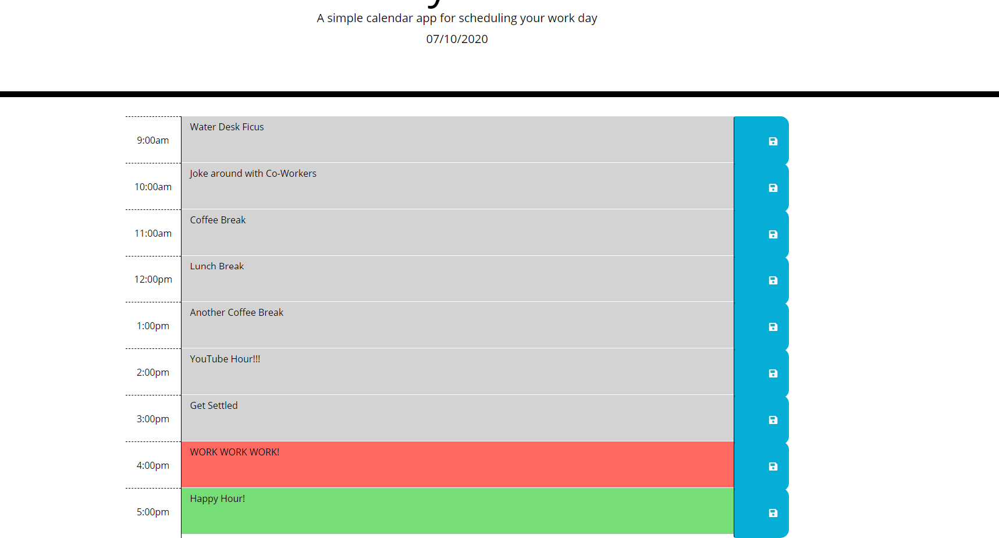

# 05 Third-Party APIs: Work Day Scheduler

I created a Work Day Scheduler...

//When the user opens their workday schedule-
//they see the date,
//they also see hours of the day from 9am-5pm.

//The user can create content within each hour of the day.
//Depending on the time of the workday (9am-5pm), the color of the hour alerts the user to...
//current hour (red),
//past hour (grey), and
//future hour(green).

//The user can save the content they create.
//When the user saves the content, they can revisit their content at any time.

